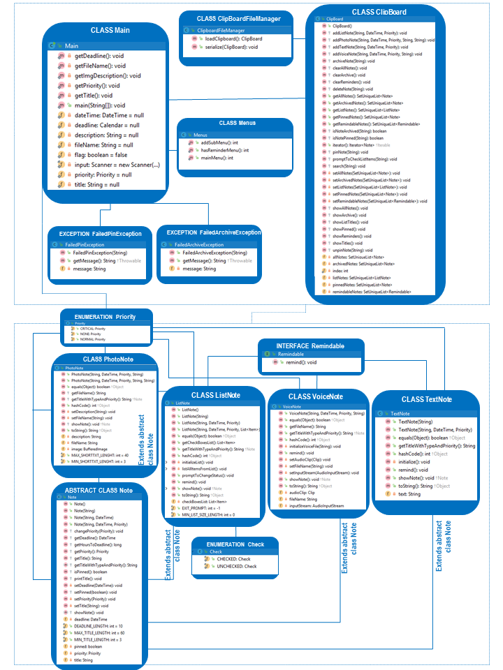

# REMINDmeApp

- **The Team:**

| Team name | Member 1 | Member 2 | Member 3 |
| :---------: | :--------: | :--------: | :--------: |
|The Vision |Десислава Алексиева (Desislava_A)|Теодор Дяков (fb_1542097102510018)|Иван Рачев (fb_1575844062463240)|

 - **Project Purpose:**  
	 **[REMIND.ME](https://github.com/Desislava-A/REMINDmeApp)  is a practical tool to organise your day:**
	     
	 - [ ] **Make , store , prioritize, search and archive notes for every task you would like to follow.**
	 - [ ] **Get reminder when a deadline is approaching.**
	 - [ ] **Mark what is DONE and PIN the most important tasks.**

  - **Class Diagram:** 
  
  

  -  **Git repository URL:** 
     https://github.com/Desislava-A/REMINDmeApp
